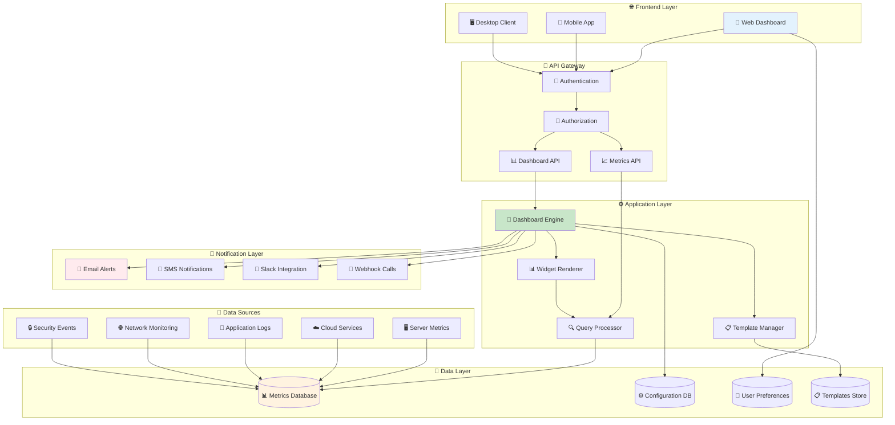
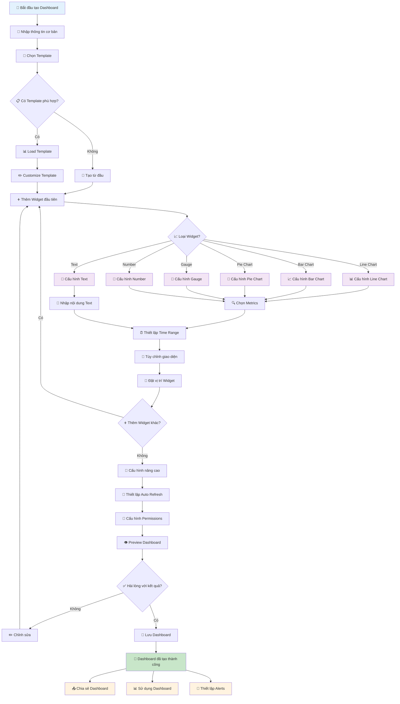

# Tạo Dashboard CloudWatch

## Giới thiệu

Dashboard CloudWatch của Viettel IDC là công cụ trực quan hóa dữ liệu giám sát, cho phép bạn tạo các bảng điều khiển tùy chỉnh để theo dõi hiệu năng hệ thống, ứng dụng và dịch vụ cloud một cách trực quan và hiệu quả.

## Tính năng chính

### 📊 Visualization Types

- **Line Charts**: Biểu đồ đường cho metrics theo thời gian
- **Bar Charts**: Biểu đồ cột so sánh giá trị
- **Pie Charts**: Biểu đồ tròn phân bố tỷ lệ
- **Gauge Charts**: Đồng hồ đo hiển thị giá trị hiện tại
- **Number Widgets**: Hiển thị số liệu đơn giản
- **Text Widgets**: Thêm ghi chú và mô tả

### 🎨 Customization Options

- **Flexible Layout**: Drag & drop để sắp xếp widgets
- **Color Themes**: Nhiều theme màu sắc chuyên nghiệp
- **Time Range**: Tùy chỉnh khoảng thời gian hiển thị
- **Auto Refresh**: Tự động cập nhật dữ liệu
- **Responsive Design**: Tối ưu cho mọi thiết bị

## Kiến trúc Dashboard System



## Quy trình tạo Dashboard

### 🔄 Workflow tổng quan



### Bước 1: Truy cập CloudWatch Console

1. Đăng nhập vào [Portal Viettel IDC](https://portal.viettelidc.com.vn)
2. Chọn **CloudWatch** từ menu dịch vụ
3. Click vào **"Dashboards"** trong sidebar
4. Nhấn nút **"Create Dashboard"**

### Bước 2: Cấu hình Dashboard cơ bản

#### 📝 Thông tin Dashboard

- **Tên Dashboard**: Tên mô tả rõ ràng (VD: "Production Server Monitoring")
- **Mô tả**: Mô tả ngắn gọn về mục đích sử dụng
- **Tags**: Gắn thẻ để phân loại và tìm kiếm
- **Permissions**: Thiết lập quyền truy cập

#### 🎨 Layout Settings

- **Grid Size**: 12 columns x unlimited rows
- **Widget Spacing**: Khoảng cách giữa các widgets
- **Background**: Màu nền dashboard
- **Theme**: Light/Dark mode

### Bước 3: Thêm Widgets

#### 📊 Line Chart Widget

```json
{
  "type": "line_chart",
  "title": "CPU Utilization",
  "metrics": [
    {
      "namespace": "AWS/EC2",
      "metric_name": "CPUUtilization",
      "dimensions": {
        "InstanceId": "i-1234567890abcdef0"
      }
    }
  ],
  "time_range": "1h",
  "refresh_interval": "1m"
}
```

**Cấu hình:**

- **Data Source**: Chọn nguồn dữ liệu (CloudWatch Metrics)
- **Metrics**: Chọn metrics cần hiển thị
- **Time Range**: 1h, 6h, 24h, 7d, 30d
- **Aggregation**: Average, Sum, Maximum, Minimum
- **Line Style**: Solid, Dashed, Dotted

#### 📈 Bar Chart Widget

```json
{
  "type": "bar_chart",
  "title": "Memory Usage by Instance",
  "metrics": [
    {
      "namespace": "CWAgent",
      "metric_name": "mem_used_percent",
      "dimensions": {
        "InstanceId": ["i-123", "i-456", "i-789"]
      }
    }
  ],
  "orientation": "vertical"
}
```

**Tùy chọn:**

- **Orientation**: Vertical/Horizontal
- **Stacking**: None, Normal, Percent
- **Color Scheme**: Automatic, Custom
- **Data Labels**: Show/Hide values

#### 🥧 Pie Chart Widget

```json
{
  "type": "pie_chart",
  "title": "Storage Usage Distribution",
  "metrics": [
    {
      "namespace": "AWS/EBS",
      "metric_name": "VolumeReadBytes",
      "dimensions": {
        "VolumeId": ["vol-123", "vol-456", "vol-789"]
      }
    }
  ],
  "show_legend": true,
  "show_percentages": true
}
```

#### 🎯 Gauge Widget

```json
{
  "type": "gauge",
  "title": "Current Load Average",
  "metric": {
    "namespace": "CWAgent",
    "metric_name": "load_average_1m"
  },
  "min_value": 0,
  "max_value": 100,
  "thresholds": [
    { "value": 70, "color": "yellow" },
    { "value": 90, "color": "red" }
  ]
}
```

### Bước 4: Cấu hình nâng cao

#### 🔍 Filters và Variables

```yaml
variables:
  - name: 'environment'
    type: 'query'
    query: 'SELECT DISTINCT environment FROM instances'
    default: 'production'

  - name: 'instance_type'
    type: 'custom'
    options: ['t3.micro', 't3.small', 't3.medium']
    default: 't3.small'

filters:
  - field: 'environment'
    operator: 'equals'
    value: '$environment'
```

#### ⏰ Time Controls

- **Global Time Range**: Áp dụng cho toàn bộ dashboard
- **Widget Time Override**: Ghi đè thời gian cho widget cụ thể
- **Relative Time**: Last 1h, 6h, 24h, 7d, 30d
- **Absolute Time**: Chọn thời gian cụ thể

#### 🔄 Auto Refresh

```json
{
  "auto_refresh": {
    "enabled": true,
    "interval": "30s",
    "options": ["10s", "30s", "1m", "5m", "15m"]
  }
}
```

## Templates Dashboard có sẵn

### 🖥️ Server Monitoring Template

- **CPU Utilization**: Line chart theo thời gian
- **Memory Usage**: Gauge với thresholds
- **Disk I/O**: Bar chart read/write operations
- **Network Traffic**: Area chart in/out bytes
- **System Load**: Number widget load average

### 🌐 Application Performance Template

- **Response Time**: Line chart với percentiles
- **Request Rate**: Bar chart requests/second
- **Error Rate**: Pie chart error distribution
- **Database Connections**: Gauge active connections
- **Cache Hit Rate**: Number widget percentage

### 🔒 Security Monitoring Template

- **Failed Login Attempts**: Line chart theo thời gian
- **Security Events**: Bar chart by severity
- **Firewall Blocks**: Pie chart by source
- **SSL Certificate Status**: Table widget
- **Vulnerability Scan Results**: Heatmap

### ☁️ Cloud Infrastructure Template

- **Resource Utilization**: Multi-line chart
- **Cost Analysis**: Stacked bar chart
- **Service Health**: Status grid
- **Auto Scaling Events**: Timeline chart
- **Backup Status**: Table with status indicators

## Best Practices

### 📐 Layout Design

1. **Logical Grouping**: Nhóm widgets liên quan gần nhau
2. **Visual Hierarchy**: Đặt metrics quan trọng ở vị trí nổi bật
3. **Consistent Sizing**: Sử dụng kích thước widget nhất quán
4. **White Space**: Để khoảng trống hợp lý giữa các widgets

### 🎨 Visual Guidelines

1. **Color Consistency**: Sử dụng màu sắc nhất quán
2. **Meaningful Titles**: Đặt tên widget rõ ràng, mô tả
3. **Appropriate Chart Types**: Chọn loại biểu đồ phù hợp với dữ liệu
4. **Threshold Indicators**: Sử dụng màu cảnh báo hợp lý

### ⚡ Performance Optimization

1. **Limit Widgets**: Không quá 20 widgets trên 1 dashboard
2. **Optimize Queries**: Sử dụng aggregation phù hợp
3. **Reasonable Refresh**: Không refresh quá thường xuyên
4. **Time Range**: Chọn khoảng thời gian hợp lý

## Chia sẻ và Collaboration

### 👥 Sharing Options

- **Public Link**: Tạo link công khai (read-only)
- **Team Access**: Chia sẻ với team members
- **Role-based Permissions**: Viewer, Editor, Admin
- **Embed Code**: Nhúng vào website/application

### 📧 Notifications

```json
{
  "notifications": {
    "email": ["admin@company.com"],
    "slack": "#monitoring-alerts",
    "webhook": "https://api.company.com/alerts"
  },
  "triggers": [
    {
      "condition": "cpu_usage > 90",
      "duration": "5m",
      "severity": "critical"
    }
  ]
}
```

### 📱 Mobile Access

- **Responsive Design**: Tự động điều chỉnh cho mobile
- **Touch Gestures**: Zoom, pan, scroll
- **Offline Viewing**: Cache dữ liệu cho offline
- **Push Notifications**: Cảnh báo qua mobile app

## Export và Backup

### 📤 Export Options

- **PDF Report**: Xuất dashboard thành PDF
- **PNG/JPEG**: Xuất từng widget hoặc toàn bộ
- **CSV Data**: Xuất dữ liệu thô
- **JSON Config**: Backup cấu hình dashboard

### 💾 Backup Strategy

```bash
# Backup dashboard configuration
curl -X GET "https://api.viettelidc.com.vn/cloudwatch/dashboards/export" \
  -H "Authorization: Bearer $TOKEN" \
  -o "dashboard-backup-$(date +%Y%m%d).json"

# Restore dashboard
curl -X POST "https://api.viettelidc.com.vn/cloudwatch/dashboards/import" \
  -H "Authorization: Bearer $TOKEN" \
  -H "Content-Type: application/json" \
  -d @dashboard-backup.json
```

## Troubleshooting

### ❌ Common Issues

#### Dashboard không load

- **Kiểm tra permissions**: Đảm bảo có quyền truy cập
- **Network connectivity**: Kiểm tra kết nối internet
- **Browser cache**: Xóa cache và reload
- **API limits**: Kiểm tra rate limiting

#### Dữ liệu không hiển thị

- **Metric availability**: Đảm bảo metrics đang được thu thập
- **Time range**: Kiểm tra khoảng thời gian phù hợp
- **Filters**: Xem lại các bộ lọc đã áp dụng
- **Data retention**: Kiểm tra chính sách lưu trữ dữ liệu

#### Performance issues

- **Too many widgets**: Giảm số lượng widgets
- **Complex queries**: Đơn giản hóa queries
- **Refresh frequency**: Tăng interval refresh
- **Browser resources**: Kiểm tra memory/CPU browser

### 🔧 Debug Tools

```javascript
// Enable debug mode
localStorage.setItem('cloudwatch_debug', 'true');

// Check widget performance
console.log(CloudWatch.getWidgetMetrics());

// Validate dashboard config
CloudWatch.validateDashboard(config);
```

## API Integration

### 🔌 REST API

```bash
# Create dashboard
POST /api/v1/dashboards
{
  "name": "My Dashboard",
  "widgets": [...],
  "layout": {...}
}

# Update dashboard
PUT /api/v1/dashboards/{id}

# Get dashboard
GET /api/v1/dashboards/{id}

# Delete dashboard
DELETE /api/v1/dashboards/{id}
```

### 📊 Widget API

```javascript
// Add widget programmatically
const widget = {
  type: 'line_chart',
  title: 'CPU Usage',
  metrics: ['cpu.utilization'],
  position: { x: 0, y: 0, width: 6, height: 4 },
};

dashboard.addWidget(widget);
```

## Liên hệ hỗ trợ

- **Documentation**: [CloudWatch Docs](../cloudwatch.md)
- **API Reference**: [API Docs](../../tools/api.md)
- **Support**: support@viettelidc.com.vn
- **Hotline**: 1900 8000
