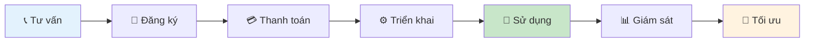

# Tổng quan dịch vụ Cloud Computing

## Giới thiệu

Viettel IDC Cloud là nền tảng điện toán đám mây toàn diện, cung cấp đầy đủ các dịch vụ từ Infrastructure as a Service (IaaS) đến Platform as a Service (PaaS), đáp ứng mọi nhu cầu của doanh nghiệp từ startup đến tập đoàn lớn.

## Kiến trúc Cloud

### Multi-Tier Architecture
- **Tier 1**: Infrastructure Layer (Compute, Storage, Network)
- **Tier 2**: Platform Layer (Database, Container, Kubernetes)
- **Tier 3**: Application Layer (Monitoring, Security, Management)

### High Availability Design
- **99.99% SLA** cam kết độ sẵn sàng
- **Multi-AZ deployment** trên nhiều vùng địa lý
- **Auto-scaling** tự động mở rộng tài nguyên
- **Load balancing** phân tải thông minh

## Danh mục dịch vụ chính

### 🖥️ Cloud Server
| Dịch vụ | Mô tả | Use Case |
|---------|-------|----------|
| **vCloud Server** | Máy chủ ảo cơ bản, linh hoạt | Website, ứng dụng web |
| **Viettel Start Cloud** | Gói khởi nghiệp giá rẻ | Startup, dự án nhỏ |
| **vCloud Server SSD** | Hiệu năng cao với SSD | Database, ứng dụng I/O cao |
| **Private Cloud** | Môi trường riêng biệt | Doanh nghiệp lớn |
| **Dedicated Private Cloud** | Hạ tầng chuyên dụng | Ngân hàng, tài chính |
| **Virtual Private Cloud** | Mạng riêng ảo | Multi-tenant secure |

### 💾 Cloud Storage
| Dịch vụ | Mô tả | Capacity |
|---------|-------|----------|
| **vStorage** | Lưu trữ đối tượng | Unlimited |
| **Object Storage** | S3-compatible storage | Petabyte scale |
| **Block Storage** | High-performance SSD/HDD | Up to 64TB |
| **File Storage** | NFS/CIFS shared storage | Multi-access |
| **Backup Storage** | Automated backup solution | Long-term retention |

### 📦 Container & Orchestration
- **vContainer**: Docker container hosting
- **vOKS**: Managed Kubernetes service
- **Container Registry**: Private image repository
- **CI/CD Pipeline**: Automated deployment

### 🗄️ Database as a Service
- **MySQL**: Relational database
- **PostgreSQL**: Advanced SQL database
- **MongoDB**: NoSQL document database
- **Redis**: In-memory cache
- **Elasticsearch**: Search engine

## Tính năng nổi bật

### 🔒 Bảo mật Enterprise
- **ISO 27001** certified data centers
- **End-to-end encryption** mã hóa toàn diện
- **Multi-factor authentication** xác thực đa yếu tố
- **Network isolation** cô lập mạng
- **DDoS protection** bảo vệ tấn công

### 📊 Giám sát & Quản lý
- **Real-time monitoring** giám sát thời gian thực
- **Custom dashboards** bảng điều khiển tùy chỉnh
- **Automated alerts** cảnh báo tự động
- **Log aggregation** tập hợp log tập trung
- **Performance analytics** phân tích hiệu năng

### 🌐 Mạng & Kết nối
- **Software-defined networking** mạng định nghĩa bằng phần mềm
- **Load balancing** cân bằng tải
- **VPN connectivity** kết nối VPN
- **Direct connect** kết nối trực tiếp
- **CDN integration** tích hợp CDN

## Mô hình triển khai

### Public Cloud
- **Shared infrastructure** hạ tầng chia sẻ
- **Pay-as-you-use** trả theo sử dụng
- **Quick deployment** triển khai nhanh
- **Suitable for**: Startup, SME, development

### Private Cloud
- **Dedicated resources** tài nguyên chuyên dụng
- **Enhanced security** bảo mật nâng cao
- **Compliance ready** sẵn sàng tuân thủ
- **Suitable for**: Enterprise, government, finance

### Hybrid Cloud
- **Best of both worlds** kết hợp ưu điểm
- **Flexible workload** khối lượng công việc linh hoạt
- **Data sovereignty** chủ quyền dữ liệu
- **Suitable for**: Large enterprise, regulated industries

## Pricing Model

### Pay-as-you-go
- Tính phí theo giờ sử dụng
- Không cam kết dài hạn
- Linh hoạt tăng/giảm tài nguyên

### Reserved Instances
- Cam kết 1-3 năm
- Giảm giá đến 60%
- Phù hợp workload ổn định

### Spot Instances
- Giá thấp nhất
- Phù hợp batch processing
- Có thể bị gián đoạn

## Compliance & Certifications

- **ISO 27001**: Information Security Management
- **ISO 20000**: IT Service Management
- **SOC 2 Type II**: Security and Availability
- **PCI DSS**: Payment Card Industry
- **GDPR**: General Data Protection Regulation
- **Vietnam Data Protection**: Tuân thủ luật Việt Nam

## Support Levels

### Basic Support
- **24/7 Portal access** truy cập portal
- **Documentation** tài liệu đầy đủ
- **Community forum** diễn đàn cộng đồng

### Business Support
- **24/7 Phone support** hỗ trợ điện thoại
- **Email support** hỗ trợ email
- **Response time**: < 4 hours

### Enterprise Support
- **Dedicated account manager** quản lý tài khoản chuyên dụng
- **Priority support** hỗ trợ ưu tiên
- **Response time**: < 1 hour
- **On-site support** hỗ trợ tại chỗ

## Getting Started

### 🚀 Quy trình bắt đầu sử dụng dịch vụ

### 📋 Các bước chi tiết

1. **Tư vấn và đánh giá** (1-3 ngày)
   - Liên hệ hotline 1900 8000
   - Phân tích nhu cầu và yêu cầu
   - Đề xuất giải pháp phù hợp

2. **Đăng ký tài khoản** (15-30 phút)
   - Truy cập [portal.viettelidc.com.vn](https://portal.viettelidc.com.vn)
   - Xác thực email và số điện thoại
   - Hoàn tất thông tin doanh nghiệp

3. **Thanh toán và hợp đồng** (1-2 giờ)
   - Chọn phương thức thanh toán
   - Ký hợp đồng điện tử
   - Xác nhận đơn hàng

4. **Triển khai dịch vụ** (2-5 ngày)
   - Provisioning tài nguyên
   - Cấu hình và testing
   - Bàn giao thông tin truy cập

5. **Sử dụng và vận hành** (Ongoing)
   - Truy cập dashboard quản lý
   - Giám sát và tối ưu hóa
   - Hỗ trợ 24/7 khi cần thiết

## Liên hệ

- **Hotline**: 1900 8000 (24/7, miễn phí)
- **Email**: support@viettelidc.com.vn
- **Portal**: [portal.viettelidc.com.vn](https://portal.viettelidc.com.vn)
- **Address**: Tầng 8, Tòa nhà Viettel, 285 Cách Mạng Tháng 8, P.12, Q.10, TP.HCM