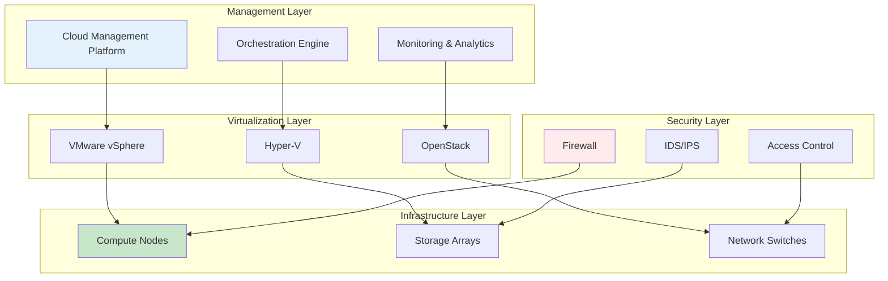

# Private Cloud

## Giới thiệu

Private Cloud của Viettel IDC là giải pháp điện toán đám mây riêng biệt, cung cấp môi trường cloud hoàn toàn độc lập và được tùy chỉnh theo nhu cầu cụ thể của doanh nghiệp. Đây là lựa chọn lý tưởng cho các tổ chức có yêu cầu cao về bảo mật, tuân thủ và kiểm soát.

## Đặc điểm nổi bật

### 🔒 Bảo mật tuyệt đối

- **Isolated Environment**: Môi trường hoàn toàn cô lập
- **Dedicated Hardware**: Phần cứng chuyên dụng
- **Custom Security**: Bảo mật tùy chỉnh theo yêu cầu
- **Compliance Ready**: Sẵn sàng tuân thủ các quy định

### 🎛️ Kiểm soát hoàn toàn

- **Full Administrative Access**: Quyền quản trị đầy đủ
- **Custom Configurations**: Cấu hình tùy chỉnh
- **Resource Allocation**: Phân bổ tài nguyên linh hoạt
- **Policy Management**: Quản lý chính sách riêng

### 📈 Hiệu năng cao

- **Guaranteed Resources**: Tài nguyên được đảm bảo
- **No Resource Contention**: Không tranh chấp tài nguyên
- **Optimized Performance**: Hiệu năng được tối ưu
- **Predictable Workloads**: Khối lượng công việc dự đoán được

## Kiến trúc Private Cloud



## Deployment Models

### 🏢 On-Premises Private Cloud

- **Customer Data Center**: Tại trung tâm dữ liệu khách hàng
- **Full Control**: Kiểm soát hoàn toàn hạ tầng
- **Custom Hardware**: Phần cứng tùy chỉnh
- **Local Compliance**: Tuân thủ quy định địa phương

### 🏭 Hosted Private Cloud

- **Viettel IDC Data Center**: Tại trung tâm dữ liệu Viettel IDC
- **Managed Infrastructure**: Hạ tầng được quản lý
- **Dedicated Resources**: Tài nguyên chuyên dụng
- **Professional Support**: Hỗ trợ chuyên nghiệp

### 🌐 Virtual Private Cloud

- **Logically Isolated**: Cô lập logic
- **Shared Infrastructure**: Hạ tầng chia sẻ
- **Cost Effective**: Hiệu quả chi phí
- **Rapid Deployment**: Triển khai nhanh chóng

## Gói dịch vụ

### Small Private Cloud

| Thông số    | Giá trị              |
| ----------- | -------------------- |
| **Compute** | 32 vCPU, 128 GB RAM  |
| **Storage** | 2 TB SSD             |
| **Network** | 1 Gbps dedicated     |
| **VMs**     | Up to 20 VMs         |
| **Giá**     | 25,000,000 VNĐ/tháng |

### Medium Private Cloud

| Thông số    | Giá trị              |
| ----------- | -------------------- |
| **Compute** | 64 vCPU, 256 GB RAM  |
| **Storage** | 5 TB SSD             |
| **Network** | 10 Gbps dedicated    |
| **VMs**     | Up to 50 VMs         |
| **Giá**     | 50,000,000 VNĐ/tháng |

### Large Private Cloud

| Thông số    | Giá trị               |
| ----------- | --------------------- |
| **Compute** | 128 vCPU, 512 GB RAM  |
| **Storage** | 10 TB SSD             |
| **Network** | 10 Gbps dedicated     |
| **VMs**     | Up to 100 VMs         |
| **Giá**     | 100,000,000 VNĐ/tháng |

### Enterprise Private Cloud

| Thông số    | Giá trị              |
| ----------- | -------------------- |
| **Compute** | 256+ vCPU, 1+ TB RAM |
| **Storage** | 20+ TB SSD           |
| **Network** | Multiple 10 Gbps     |
| **VMs**     | Unlimited            |
| **Giá**     | Custom pricing       |

## Use Cases

### 🏛️ Government & Public Sector

- **Data Sovereignty**: Chủ quyền dữ liệu
- **Regulatory Compliance**: Tuân thủ quy định
- **Citizen Services**: Dịch vụ công dân
- **Inter-agency Collaboration**: Hợp tác liên cơ quan

### 🏦 Financial Services

- **Banking Systems**: Hệ thống ngân hàng
- **Trading Platforms**: Nền tảng giao dịch
- **Risk Management**: Quản lý rủi ro
- **Regulatory Reporting**: Báo cáo tuân thủ

### 🏥 Healthcare

- **Patient Records**: Hồ sơ bệnh nhân
- **Medical Imaging**: Hình ảnh y tế
- **Research Data**: Dữ liệu nghiên cứu
- **HIPAA Compliance**: Tuân thủ HIPAA

### 🏭 Manufacturing

- **ERP Systems**: Hệ thống ERP
- **Supply Chain**: Chuỗi cung ứng
- **Quality Control**: Kiểm soát chất lượng
- **IoT Integration**: Tích hợp IoT

## Management Platform

### Cloud Management Features

```yaml
Resource Management:
  - Virtual Machine Lifecycle
  - Storage Provisioning
  - Network Configuration
  - Load Balancing

Automation:
  - Template Deployment
  - Auto-scaling
  - Backup Scheduling
  - Patch Management

Monitoring:
  - Performance Metrics
  - Resource Utilization
  - Health Monitoring
  - Alerting

Security:
  - Access Control
  - Encryption
  - Audit Logging
  - Compliance Reporting
```

### Self-Service Portal

- **VM Provisioning**: Tự phục vụ tạo VM
- **Resource Monitoring**: Giám sát tài nguyên
- **Backup Management**: Quản lý sao lưu
- **Cost Analytics**: Phân tích chi phí

## Security & Compliance

### Multi-layered Security

```
Security Layers:
├── Physical Security
│   ├── Biometric Access
│   ├── 24/7 Surveillance
│   └── Environmental Controls
├── Network Security
│   ├── Firewalls
│   ├── IDS/IPS
│   └── VPN Gateways
├── Platform Security
│   ├── Hypervisor Hardening
│   ├── VM Isolation
│   └── Secure Boot
└── Data Security
    ├── Encryption at Rest
    ├── Encryption in Transit
    └── Key Management
```

### Compliance Standards

- **ISO 27001**: Information Security Management
- **SOC 2 Type II**: Security and Availability
- **PCI DSS**: Payment Card Industry
- **GDPR**: General Data Protection Regulation
- **Vietnam Cybersecurity Law**: Luật An toàn thông tin mạng

## Disaster Recovery

### Business Continuity

```bash
# DR Site Configuration
Primary Site: Viettel IDC Hanoi
DR Site: Viettel IDC Ho Chi Minh City

# Replication Strategy
- Synchronous replication for critical data
- Asynchronous replication for non-critical data
- RPO: 15 minutes
- RTO: 4 hours
```

### Backup Strategy

- **Daily Incremental**: Sao lưu tăng dần hàng ngày
- **Weekly Full**: Sao lưu đầy đủ hàng tuần
- **Monthly Archive**: Lưu trữ hàng tháng
- **Cross-site Replication**: Sao chép liên site

## Migration Services

### Assessment Phase

```bash
# Infrastructure Assessment
- Current hardware inventory
- Application dependencies
- Performance baselines
- Security requirements

# Migration Planning
- Workload prioritization
- Migration timeline
- Risk assessment
- Rollback procedures
```

### Migration Execution

1. **Pilot Migration**: Di chuyển thử nghiệm
2. **Phased Approach**: Tiếp cận từng giai đoạn
3. **Parallel Running**: Chạy song song
4. **Cutover**: Chuyển đổi hoàn toàn

## Cost Model

### Pricing Components

| Component      | Description            | Pricing Model    |
| -------------- | ---------------------- | ---------------- |
| **Compute**    | CPU, RAM resources     | Per vCPU/GB RAM  |
| **Storage**    | SSD/HDD storage        | Per GB/month     |
| **Network**    | Bandwidth, connections | Per Mbps         |
| **Management** | Platform licensing     | Per VM           |
| **Support**    | Technical support      | Included/Premium |

### Cost Optimization

- **Resource Right-sizing**: Định cỡ tài nguyên phù hợp
- **Automated Scaling**: Mở rộng tự động
- **Usage Analytics**: Phân tích sử dụng
- **Reserved Capacity**: Dung lượng dành riêng

## Implementation Timeline

### Phase 1: Planning (2-4 weeks)

- Requirements gathering
- Architecture design
- Security planning
- Resource sizing

### Phase 2: Infrastructure (4-6 weeks)

- Hardware procurement
- Network setup
- Platform installation
- Security configuration

### Phase 3: Migration (2-8 weeks)

- Pilot migration
- Application testing
- User training
- Production cutover

### Phase 4: Optimization (Ongoing)

- Performance tuning
- Cost optimization
- Security updates
- Capacity planning

## Support Services

### 24/7 Operations

- **NOC Monitoring**: Giám sát trung tâm vận hành
- **Incident Response**: Phản hồi sự cố
- **Change Management**: Quản lý thay đổi
- **Capacity Planning**: Lập kế hoạch dung lượng

### Professional Services

- **Architecture Consulting**: Tư vấn kiến trúc
- **Migration Services**: Dịch vụ di chuyển
- **Training Programs**: Chương trình đào tạo
- **Health Checks**: Kiểm tra sức khỏe hệ thống

## Getting Started

### Initial Consultation

```bash
# Contact Information
Sales: sales@viettelidc.com.vn
Technical: technical@viettelidc.com.vn
Phone: 1900 8000

# Required Information
- Current infrastructure overview
- Business requirements
- Compliance needs
- Timeline expectations
```

### Proof of Concept

- **30-day trial**: Dùng thử 30 ngày
- **Limited scope**: Phạm vi giới hạn
- **Full features**: Đầy đủ tính năng
- **Migration support**: Hỗ trợ di chuyển

## Liên hệ

- **Sales Team**: sales@viettelidc.com.vn
- **Technical Consulting**: consulting@viettelidc.com.vn
- **Support**: support@viettelidc.com.vn
- **Hotline**: 1900 8000
- **Portal**: [portal.viettelidc.com.vn](https://portal.viettelidc.com.vn)
