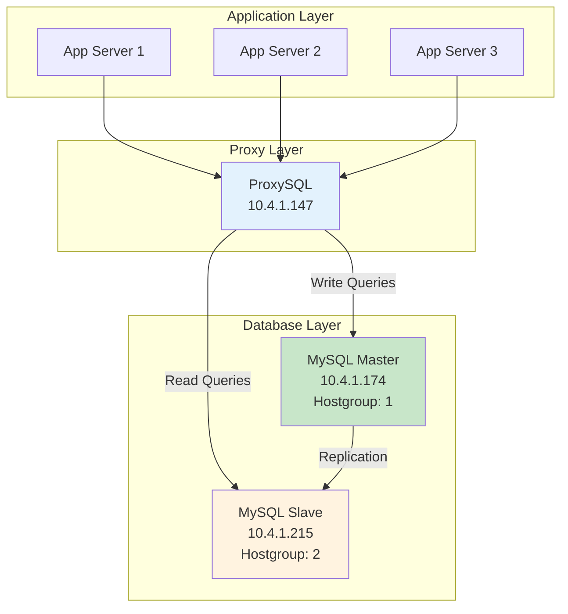
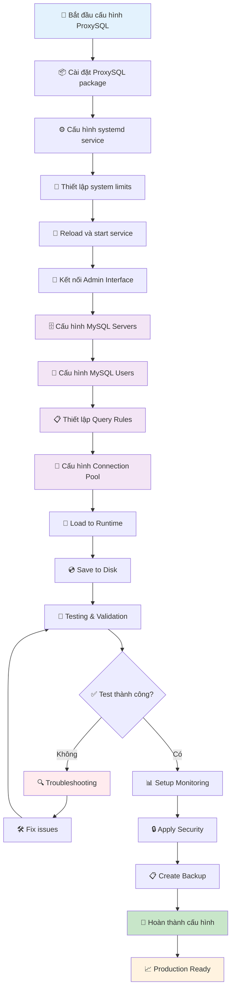

# Cấu hình ProxySQL cho MySQL

## Giới thiệu

ProxySQL là một proxy server hiệu năng cao cho MySQL, cung cấp khả năng load balancing, connection pooling, và query routing. Tài liệu này hướng dẫn cấu hình ProxySQL để quản lý kết nối giữa ứng dụng và MySQL Master-Slave cluster.

## Kiến trúc hệ thống



## Thông tin môi trường

| Component        | IP Address | Port                       | Role             |
| ---------------- | ---------- | -------------------------- | ---------------- |
| **ProxySQL**     | 10.4.1.147 | 6033 (MySQL), 6032 (Admin) | Proxy Server     |
| **MySQL Master** | 10.4.1.174 | 3306                       | Write Operations |
| **MySQL Slave**  | 10.4.1.215 | 3306                       | Read Operations  |

## Quy trình cấu hình tổng quan



## Cài đặt ProxySQL

### 1. Cài đặt package

```bash
# Download và cài đặt ProxySQL
wget https://github.com/sysown/proxysql/releases/download/v2.5.5/proxysql_2.5.5-1_amd64.deb
sudo dpkg -i proxysql_2.5.5-1_amd64.deb

# Hoặc sử dụng repository
echo 'deb https://repo.proxysql.com/ProxySQL/proxysql-2.5.x/$(lsb_release -sc)/ ./' | sudo tee /etc/apt/sources.list.d/proxysql.list
wget -O - 'https://repo.proxysql.com/ProxySQL/proxysql-signing-key.asc' | sudo apt-key add -
sudo apt update
sudo apt install proxysql
```

### 2. Cấu hình systemd service

Tạo file cấu hình systemd tại `/lib/systemd/system/proxysql.service`:

```ini
[Unit]
Description=High Performance Advanced Proxy for MySQL
After=network.target

[Service]
Type=forking
User=proxysql
Group=proxysql
ExecStart=/usr/bin/proxysql --initial -f -c /etc/proxysql.cnf
ExecReload=/bin/kill -HUP $MAINPID
KillMode=process
Restart=always
StartLimitIntervalSec=60
StartLimitBurst=3
RestartSec=5
LimitMEMLOCK=512M
LimitNOFILE=100000
TimeoutSec=0

[Install]
WantedBy=multi-user.target
```

### 3. Cấu hình giới hạn hệ thống

#### Cấu hình limits trong systemd

```ini
# Thêm vào /lib/systemd/system/proxysql.service trong section [Service]
LimitMEMLOCK=512M
LimitNOFILE=100000
```

#### Cấu hình system limits

```bash
# Thêm vào /etc/security/limits.conf
*          soft    nofile      100000
*          hard    nofile      100000
proxysql   soft    nofile      100000
proxysql   hard    nofile      100000
proxysql   soft    memlock     unlimited
proxysql   hard    memlock     unlimited
```

### 4. Reload và khởi động service

```bash
# Reload systemd configuration
sudo systemctl daemon-reexec
sudo systemctl daemon-reload

# Enable và start ProxySQL
sudo systemctl enable proxysql
sudo systemctl start proxysql

# Kiểm tra status
sudo systemctl status proxysql
```

## Cấu hình ProxySQL

### 1. Truy cập ProxySQL Admin Interface

```bash
# Kết nối đến ProxySQL admin interface
mysql -u admin -padmin -h 127.0.0.1 -P6032 --prompt='ProxySQL Admin> '
```

### 2. Cấu hình MySQL Servers

#### Khai báo MySQL servers

```sql
-- Xóa cấu hình cũ (nếu có)
DELETE FROM mysql_servers;

-- Thêm MySQL Master và Slave
INSERT INTO mysql_servers (hostgroup_id, hostname, port, weight, status, comment)
VALUES
(1, '10.4.1.174', 3306, 1000, 'ONLINE', 'MySQL Master - Write Operations'),
(2, '10.4.1.215', 3306, 1000, 'ONLINE', 'MySQL Slave - Read Operations');

-- Load cấu hình vào runtime
LOAD MYSQL SERVERS TO RUNTIME;

-- Lưu cấu hình vào disk
SAVE MYSQL SERVERS TO DISK;

-- Kiểm tra cấu hình
SELECT * FROM mysql_servers;
```

### 3. Cấu hình MySQL Users

```sql
-- Tạo user cho ứng dụng
INSERT INTO mysql_users (username, password, default_hostgroup, max_connections, comment)
VALUES
('app_user', 'secure_password', 1, 200, 'Application user'),
('readonly_user', 'readonly_password', 2, 100, 'Read-only user');

-- Load và save users
LOAD MYSQL USERS TO RUNTIME;
SAVE MYSQL USERS TO DISK;

-- Kiểm tra users
SELECT * FROM mysql_users;
```

### 4. Cấu hình Query Rules

```sql
-- Rule 1: Route SELECT queries to slave (hostgroup 2)
INSERT INTO mysql_query_rules (rule_id, active, match_pattern, destination_hostgroup, apply, comment)
VALUES
(1, 1, '^SELECT.*', 2, 1, 'Route SELECT to slave'),
(2, 1, '^INSERT.*|^UPDATE.*|^DELETE.*|^CREATE.*|^DROP.*|^ALTER.*', 1, 1, 'Route write operations to master');

-- Load và save query rules
LOAD MYSQL QUERY RULES TO RUNTIME;
SAVE MYSQL QUERY RULES TO DISK;

-- Kiểm tra query rules
SELECT * FROM mysql_query_rules ORDER BY rule_id;
```

### 5. Cấu hình Connection Pooling

```sql
-- Cấu hình global variables
UPDATE global_variables SET variable_value='200' WHERE variable_name='mysql-max_connections';
UPDATE global_variables SET variable_value='4' WHERE variable_name='mysql-server_version';
UPDATE global_variables SET variable_value='8.0.33' WHERE variable_name='mysql-server_version';
UPDATE global_variables SET variable_value='true' WHERE variable_name='mysql-have_compress';
UPDATE global_variables SET variable_value='true' WHERE variable_name='mysql-have_ssl';

-- Load global variables
LOAD MYSQL VARIABLES TO RUNTIME;
SAVE MYSQL VARIABLES TO DISK;
```

## Monitoring và Health Check

### 1. Kiểm tra trạng thái servers

```sql
-- Kiểm tra trạng thái MySQL servers
SELECT * FROM stats_mysql_connection_pool;

-- Kiểm tra query statistics
SELECT * FROM stats_mysql_query_rules;

-- Kiểm tra command statistics
SELECT * FROM stats_mysql_commands_counters;
```

### 2. Health check script

Tạo script monitoring tại `/opt/proxysql/health_check.sh`:

```bash
#!/bin/bash

PROXYSQL_ADMIN_USER="admin"
PROXYSQL_ADMIN_PASS="admin"
PROXYSQL_ADMIN_HOST="127.0.0.1"
PROXYSQL_ADMIN_PORT="6032"

# Function to check server status
check_server_status() {
    mysql -u${PROXYSQL_ADMIN_USER} -p${PROXYSQL_ADMIN_PASS} \
          -h${PROXYSQL_ADMIN_HOST} -P${PROXYSQL_ADMIN_PORT} \
          -e "SELECT hostgroup_id, hostname, port, status, ConnUsed, ConnFree, ConnOK, ConnERR FROM stats_mysql_connection_pool;" \
          2>/dev/null
}

# Function to check query distribution
check_query_distribution() {
    mysql -u${PROXYSQL_ADMIN_USER} -p${PROXYSQL_ADMIN_PASS} \
          -h${PROXYSQL_ADMIN_HOST} -P${PROXYSQL_ADMIN_PORT} \
          -e "SELECT hostgroup, sum_time, count_star FROM stats_mysql_connection_pool;" \
          2>/dev/null
}

echo "=== ProxySQL Health Check ==="
echo "Server Status:"
check_server_status

echo -e "\nQuery Distribution:"
check_query_distribution

echo -e "\nProxySQL Process Status:"
systemctl is-active proxysql
```

### 3. Cấu hình log monitoring

```bash
# Tạo logrotate configuration
sudo tee /etc/logrotate.d/proxysql << EOF
/var/lib/proxysql/proxysql.log {
    daily
    missingok
    rotate 7
    compress
    notifempty
    create 0640 proxysql proxysql
    postrotate
        systemctl reload proxysql
    endscript
}
EOF
```

## Backup và Recovery

### 1. Backup cấu hình ProxySQL

```bash
#!/bin/bash
# Backup script: /opt/proxysql/backup_config.sh

BACKUP_DIR="/opt/proxysql/backups"
DATE=$(date +%Y%m%d_%H%M%S)
BACKUP_FILE="proxysql_config_${DATE}.sql"

mkdir -p ${BACKUP_DIR}

# Export ProxySQL configuration
mysql -u admin -padmin -h 127.0.0.1 -P6032 -e "
SELECT 'mysql_servers' as table_name;
SELECT * FROM mysql_servers;
SELECT 'mysql_users' as table_name;
SELECT * FROM mysql_users;
SELECT 'mysql_query_rules' as table_name;
SELECT * FROM mysql_query_rules;
SELECT 'global_variables' as table_name;
SELECT * FROM global_variables WHERE variable_name LIKE 'mysql-%';
" > ${BACKUP_DIR}/${BACKUP_FILE}

echo "Backup completed: ${BACKUP_DIR}/${BACKUP_FILE}"
```

### 2. Restore cấu hình

```sql
-- Restore từ backup (thực hiện manual)
-- 1. Kết nối đến ProxySQL admin
-- 2. Thực hiện các INSERT statements từ backup file
-- 3. Load và save configuration

LOAD MYSQL SERVERS TO RUNTIME;
LOAD MYSQL USERS TO RUNTIME;
LOAD MYSQL QUERY RULES TO RUNTIME;
LOAD MYSQL VARIABLES TO RUNTIME;

SAVE MYSQL SERVERS TO DISK;
SAVE MYSQL USERS TO DISK;
SAVE MYSQL QUERY RULES TO DISK;
SAVE MYSQL VARIABLES TO DISK;
```

## Troubleshooting

### 1. Common Issues

#### ProxySQL không start được

```bash
# Kiểm tra logs
sudo journalctl -u proxysql -f

# Kiểm tra file cấu hình
sudo proxysql --check-config

# Kiểm tra permissions
sudo chown -R proxysql:proxysql /var/lib/proxysql
```

#### Connection issues

```sql
-- Kiểm tra connection pool
SELECT * FROM stats_mysql_connection_pool;

-- Kiểm tra error logs
SELECT * FROM stats_mysql_errors;

-- Reset connection pool
PROXYSQL FLUSH MYSQL CONNECTIONS;
```

#### Query routing không hoạt động

```sql
-- Kiểm tra query rules
SELECT * FROM mysql_query_rules WHERE active=1;

-- Test query routing
SELECT * FROM stats_mysql_query_digest ORDER BY count_star DESC LIMIT 10;
```

### 2. Performance Tuning

```sql
-- Tăng connection pool size
UPDATE global_variables SET variable_value='500' WHERE variable_name='mysql-max_connections';

-- Cấu hình timeout
UPDATE global_variables SET variable_value='28800000' WHERE variable_name='mysql-wait_timeout';
UPDATE global_variables SET variable_value='28800000' WHERE variable_name='mysql-interactive_timeout';

-- Connection multiplexing
UPDATE global_variables SET variable_value='true' WHERE variable_name='mysql-multiplexing';

LOAD MYSQL VARIABLES TO RUNTIME;
SAVE MYSQL VARIABLES TO DISK;
```

## Security Best Practices

### 1. Thay đổi default passwords

```sql
-- Thay đổi admin password
UPDATE global_variables SET variable_value='new_secure_admin_password' WHERE variable_name='admin-admin_credentials';

-- Thay đổi stats password
UPDATE global_variables SET variable_value='stats_user:new_secure_stats_password' WHERE variable_name='admin-stats_credentials';

LOAD ADMIN VARIABLES TO RUNTIME;
SAVE ADMIN VARIABLES TO DISK;
```

### 2. Firewall configuration

```bash
# Chỉ cho phép kết nối từ application servers
sudo ufw allow from 10.4.1.0/24 to any port 6033
sudo ufw allow from 127.0.0.1 to any port 6032
sudo ufw deny 6032
sudo ufw deny 6033
```

## Liên hệ hỗ trợ

- **Documentation**: [vDatabase Guide](../vdbs.md)
- **MySQL Configuration**: [MySQL Setup](mysql.md)
- **Support**: support@viettelidc.com.vn
- **Hotline**: 1900 8000
