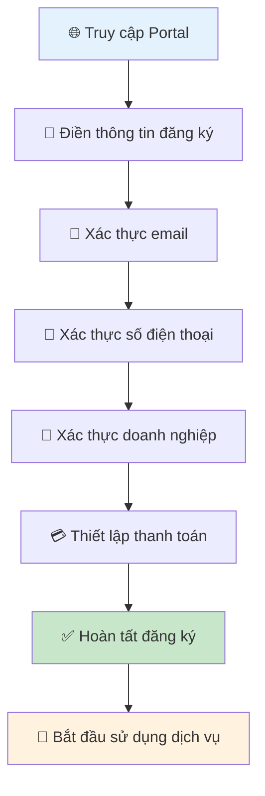

# Hướng dẫn đăng ký tài khoản

Để bắt đầu sử dụng dịch vụ Cloud của Viettel IDC, bạn cần đăng ký một tài khoản trên hệ thống Cloud Management Platform. Bài viết này sẽ hướng dẫn bạn các bước đăng ký tài khoản một cách chi tiết.

## 🔄 Quy trình đăng ký tổng quan

### ⏱️ Thời gian hoàn thành
- **Tài khoản cá nhân**: 10-15 phút
- **Tài khoản doanh nghiệp**: 15-30 phút (+ 1-2 ngày xác thực)

### 📋 Checklist chuẩn bị
- [ ] Email hợp lệ và có thể truy cập
- [ ] Số điện thoại di động
- [ ] Giấy tờ tùy thân (CMND/CCCD)
- [ ] Giấy phép kinh doanh (đối với doanh nghiệp)
- [ ] Phương thức thanh toán

## Yêu cầu

Trước khi đăng ký, bạn cần chuẩn bị:

- Địa chỉ email hợp lệ (sẽ được sử dụng để xác thực tài khoản)
- Số điện thoại di động (dùng để xác thực và nhận thông báo)
- Thông tin cá nhân hoặc tổ chức (tùy theo loại tài khoản đăng ký)

## Các bước đăng ký tài khoản

### Bước 1: Truy cập trang đăng ký

Truy cập [Cloud Management Platform](https://portal.viettelidc.com.vn/) của Viettel IDC và nhấp vào nút **"Đăng ký"** ở góc phải trên cùng của trang.

### Bước 2: Chọn loại tài khoản

Chọn loại tài khoản phù hợp với nhu cầu của bạn:

- **Tài khoản cá nhân**: Dành cho người dùng cá nhân
- **Tài khoản doanh nghiệp**: Dành cho tổ chức, doanh nghiệp

### Bước 3: Điền thông tin đăng ký

#### Đối với tài khoản cá nhân:

- Họ và tên
- Địa chỉ email
- Số điện thoại
- Mật khẩu (và xác nhận mật khẩu)
- Địa chỉ

#### Đối với tài khoản doanh nghiệp:

- Tên doanh nghiệp
- Mã số thuế
- Địa chỉ doanh nghiệp
- Thông tin người đại diện
- Địa chỉ email doanh nghiệp
- Số điện thoại liên hệ
- Mật khẩu (và xác nhận mật khẩu)

### Bước 4: Xác thực email

Sau khi hoàn tất việc điền thông tin, hệ thống sẽ gửi một email xác thực đến địa chỉ email bạn đã đăng ký. Vui lòng kiểm tra hộp thư đến (và cả thư mục spam) để tìm email xác thực từ Viettel IDC.

Nhấp vào liên kết xác thực trong email để kích hoạt tài khoản của bạn.

### Bước 5: Xác thực số điện thoại

Sau khi xác thực email thành công, bạn sẽ được yêu cầu xác thực số điện thoại thông qua mã OTP. Hệ thống sẽ gửi một mã OTP đến số điện thoại bạn đã đăng ký.

Nhập mã OTP vào ô xác thực để hoàn tất quá trình xác thực số điện thoại.

### Bước 6: Hoàn tất đăng ký

Sau khi xác thực thành công cả email và số điện thoại, tài khoản của bạn đã được tạo thành công. Bạn sẽ được chuyển hướng đến trang Dashboard của Cloud Management Platform.

## Đăng nhập vào tài khoản

Sau khi đã đăng ký thành công, bạn có thể đăng nhập vào tài khoản bằng cách:

1. Truy cập [Cloud Management Platform](https://portal.viettelidc.com.vn/)
2. Nhấp vào nút **"Đăng nhập"** ở góc phải trên cùng
3. Nhập địa chỉ email và mật khẩu đã đăng ký
4. Nhấp vào nút **"Đăng nhập"**

## Quên mật khẩu

Nếu bạn quên mật khẩu, bạn có thể khôi phục mật khẩu bằng cách:

1. Truy cập trang đăng nhập
2. Nhấp vào liên kết **"Quên mật khẩu"**
3. Nhập địa chỉ email đã đăng ký
4. Làm theo hướng dẫn được gửi đến email của bạn để đặt lại mật khẩu

## Cập nhật thông tin tài khoản

Sau khi đăng nhập, bạn có thể cập nhật thông tin tài khoản bằng cách:

1. Nhấp vào tên người dùng ở góc phải trên cùng
2. Chọn **"Thông tin tài khoản"**
3. Cập nhật thông tin cần thiết
4. Nhấp vào nút **"Lưu thay đổi"**

## Lưu ý bảo mật

Để đảm bảo an toàn cho tài khoản của bạn, vui lòng tuân thủ các nguyên tắc sau:

- Sử dụng mật khẩu mạnh (kết hợp chữ hoa, chữ thường, số và ký tự đặc biệt)
- Không chia sẻ thông tin đăng nhập với người khác
- Đăng xuất khỏi tài khoản khi sử dụng máy tính công cộng
- Thường xuyên thay đổi mật khẩu
- Bật xác thực hai yếu tố nếu có thể

## Hỗ trợ

Nếu bạn gặp bất kỳ vấn đề nào trong quá trình đăng ký tài khoản, vui lòng liên hệ với đội ngũ hỗ trợ của Viettel IDC qua:

- Hotline: 1800 xxxx
- Email: support@viettelidc.com.vn
- [Trang hỗ trợ](../support.md)
