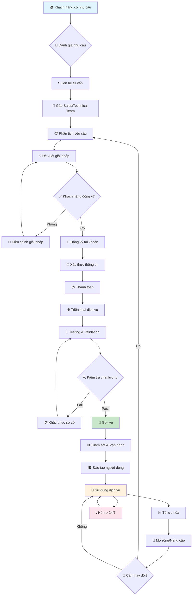
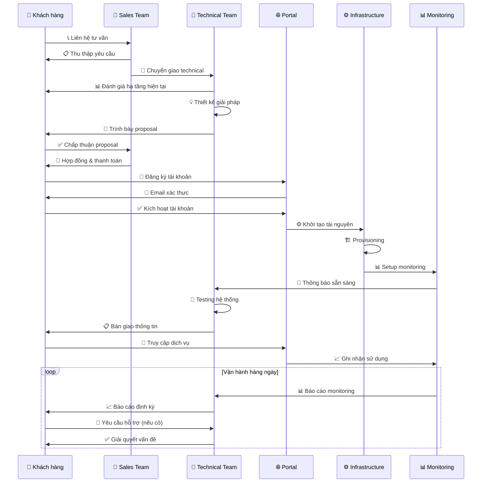
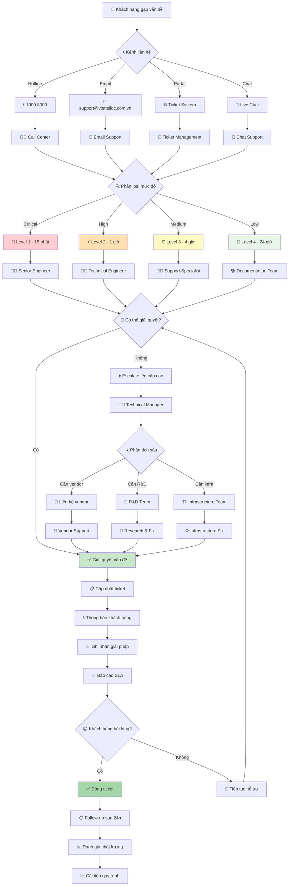

# Quy trình sử dụng dịch vụ Viettel IDC

## Tổng quan

Tài liệu này mô tả chi tiết quy trình sử dụng dịch vụ của Viettel IDC từ khâu tư vấn, đăng ký, triển khai đến vận hành và hỗ trợ. Chúng tôi cam kết mang đến trải nghiệm khách hàng tốt nhất với quy trình chuẩn hóa và chuyên nghiệp.

## 🔄 Quy trình tổng quan

## 📋 Chi tiết từng giai đoạn

### Giai đoạn 1: Tư vấn và Đánh giá (1-3 ngày)

#### 🎯 Mục tiêu

- Hiểu rõ nhu cầu và yêu cầu của khách hàng
- Đánh giá hạ tầng hiện tại
- Đề xuất giải pháp phù hợp

#### 📞 Kênh liên hệ

- **Hotline**: 1900 8000 (24/7, miễn phí)
- **Email**: sales@viettelidc.com.vn
- **Website**: [viettelidc.com.vn](https://viettelidc.com.vn)
- **Showroom**: Tại Hà Nội, TP.HCM, Đà Nẵng

#### 🔍 Quy trình đánh giá

1. **Thu thập thông tin cơ bản**

   - Loại hình doanh nghiệp
   - Quy mô và ngành nghề
   - Yêu cầu kỹ thuật
   - Ngân sách dự kiến

2. **Phân tích hạ tầng hiện tại**

   - Kiến trúc hệ thống
   - Khối lượng dữ liệu
   - Lưu lượng truy cập
   - Yêu cầu bảo mật

3. **Đề xuất giải pháp**
   - Kiến trúc đề xuất
   - Cấu hình chi tiết
   - Roadmap triển khai
   - Ước tính chi phí

### Giai đoạn 2: Đăng ký và Thanh toán (1-2 ngày)

#### 📝 Quy trình đăng ký

1. **Tạo tài khoản**

   - Truy cập [portal.viettelidc.com.vn](https://portal.viettelidc.com.vn)
   - Điền thông tin cơ bản
   - Xác thực email và số điện thoại

2. **Xác thực danh tính**

   - Upload giấy tờ pháp lý
   - Xác thực thông tin doanh nghiệp
   - Ký hợp đồng điện tử

3. **Thanh toán**
   - Chuyển khoản ngân hàng
   - Thẻ tín dụng/ghi nợ
   - Ví điện tử (MoMo, ZaloPay)

#### 💳 Phương thức thanh toán

| Phương thức      | Thời gian xử lý | Phí giao dịch |
| ---------------- | --------------- | ------------- |
| **Chuyển khoản** | 1-2 giờ         | Miễn phí      |
| **Thẻ tín dụng** | Tức thì         | 2.5%          |
| **Ví điện tử**   | Tức thì         | 1.5%          |

### Giai đoạn 3: Triển khai Dịch vụ (2-5 ngày)

#### ⚙️ Quy trình triển khai

#### 🏗️ Các bước triển khai chi tiết

1. **Provisioning (30 phút - 2 giờ)**

   - Khởi tạo tài nguyên
   - Cấu hình network
   - Setup security groups
   - Cài đặt monitoring

2. **Configuration (1-4 giờ)**

   - Cài đặt hệ điều hành
   - Cấu hình ứng dụng
   - Setup backup
   - Security hardening

3. **Testing (2-8 giờ)**

   - Functional testing
   - Performance testing
   - Security testing
   - Load testing

4. **Go-live (1-2 giờ)**
   - Final validation
   - DNS cutover
   - Monitoring activation
   - Documentation handover

### Giai đoạn 4: Vận hành và Hỗ trợ (24/7)

#### 📊 Giám sát liên tục

- **Infrastructure monitoring**: CPU, RAM, Disk, Network
- **Application monitoring**: Response time, Error rate
- **Security monitoring**: Intrusion detection, Vulnerability scan
- **Business monitoring**: SLA, Performance metrics

#### 🎓 Đào tạo người dùng

- **Basic training**: Portal usage, Basic operations
- **Advanced training**: API usage, Advanced features
- **Admin training**: User management, Security configuration
- **Custom training**: Specific to customer needs

#### 📈 Tối ưu hóa định kỳ

- **Monthly review**: Performance analysis
- **Quarterly optimization**: Resource right-sizing
- **Annual planning**: Capacity planning, Technology refresh

## 🆘 Quy trình hỗ trợ 24/7

### 🎯 Mức độ ưu tiên hỗ trợ

| Mức độ       | Thời gian phản hồi | Mô tả                                | Ví dụ                       |
| ------------ | ------------------ | ------------------------------------ | --------------------------- |
| **Critical** | 15 phút            | Dịch vụ ngừng hoạt động hoàn toàn    | Server down, Network outage |
| **High**     | 1 giờ              | Ảnh hưởng nghiêm trọng đến hoạt động | Performance degradation     |
| **Medium**   | 4 giờ              | Ảnh hưởng một phần                   | Feature không hoạt động     |
| **Low**      | 24 giờ             | Câu hỏi tư vấn, yêu cầu thông tin    | Documentation request       |

### 📞 Kênh hỗ trợ

#### Hotline 24/7

- **Số điện thoại**: 1900 8000
- **Miễn phí**: Từ mọi mạng tại Việt Nam
- **Ngôn ngữ**: Tiếng Việt, English
- **Chuyên gia**: Technical support engineers

#### Email Support

- **General**: support@viettelidc.com.vn
- **Technical**: technical@viettelidc.com.vn
- **Billing**: billing@viettelidc.com.vn
- **Emergency**: emergency@viettelidc.com.vn

#### Portal & Chat

- **Portal**: [portal.viettelidc.com.vn](https://portal.viettelidc.com.vn)
- **Live Chat**: Có sẵn trên portal
- **Ticket System**: Quản lý yêu cầu hỗ trợ
- **Knowledge Base**: Tài liệu tự phục vụ

## 📊 SLA và Cam kết

### 🎯 Service Level Agreement

| Dịch vụ           | Uptime SLA | MTTR         | Penalty        |
| ----------------- | ---------- | ------------ | -------------- |
| **vCloud Server** | 99.9%      | < 4 hours    | Service credit |
| **vStorage**      | 99.99%     | < 2 hours    | Service credit |
| **vDatabase**     | 99.95%     | < 1 hour     | Service credit |
| **Network**       | 99.9%      | < 30 minutes | Service credit |

### 📈 Báo cáo định kỳ

- **Daily**: Incident reports
- **Weekly**: Performance summary
- **Monthly**: SLA compliance report
- **Quarterly**: Business review

## 🔄 Quy trình nâng cấp/Mở rộng

### 📈 Scaling Up/Down

1. **Đánh giá nhu cầu**: Phân tích usage patterns
2. **Đề xuất thay đổi**: Right-sizing recommendations
3. **Approval**: Khách hàng phê duyệt
4. **Implementation**: Thực hiện thay đổi
5. **Validation**: Kiểm tra sau thay đổi

### 🔄 Migration

1. **Assessment**: Đánh giá hiện trạng
2. **Planning**: Lập kế hoạch migration
3. **Testing**: Test migration process
4. **Execution**: Thực hiện migration
5. **Validation**: Kiểm tra kết quả

## 📞 Liên hệ

- **Sales**: sales@viettelidc.com.vn
- **Support**: support@viettelidc.com.vn
- **Hotline**: 1900 8000
- **Portal**: [portal.viettelidc.com.vn](https://portal.viettelidc.com.vn)
